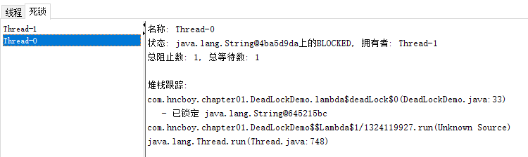

# 一、上下文切换
CPU 通过给每个线程分配 CPU 时间片上下文切换，时间片很短，CPU 通过不停的切换线程执行时间片，让我们感觉多个线程是一起执行的。任务从保存到加载的过程就是一次上下文切换，上下文切换也会影响线程的执行效率。

## 1.多线程速度
线程有创建和上下文切换的开销，速度不一定比单线程快。

## 2.减少上下文切换
- 无锁并发编程：多线程竞争锁时，会引起上下文切换，所以使用多线程处理数据时，可以用一些办法来避免使用锁。
- CAS 算法：Java 的 Atomic 包使用 CAS 算法更新数据，不需要加锁。
- 使用最少线程：避免创建不需要的线程，根据任务的数量来合理的创建线程。
- 协程：在单线程里实现多任务的调度，并在单线程里维持多个任务间的切换。

# 二、死锁
产生死锁的代码：
```
public class DeadLockDemo {

    /**
     * A 锁
     */
    private static final String A = "A";

    /**
     * B 锁
     */
    private static final String B = "B";

    public static void main(String[] args) {
        new DeadLockDemo().deadLock();
    }

    private void deadLock() {
        Thread t1 = new Thread(() -> {
            synchronized (A) {
                try {
                    Thread.sleep(2000);
                } catch (InterruptedException e) {
                    e.printStackTrace();
                }
                synchronized (B) {
                    System.out.println("1");
                }
            }
        });

        Thread t2 = new Thread(() -> {
            synchronized (B) {
                synchronized (A) {
                    System.out.println("2");
                }
            }
        });

        t1.start();
        t2.start();
    }
}
```
使用 Jconsole 查看死锁如图 1 图 2 所示
<div align = "center">
     </div>
<div align = "center"> 图 1 </div><br>
<div align = "center">
     </div>
<div align = "center"> 图 2 </div><br>

避免死锁的常见方法：
- 避免一个线程同时获得多个锁。
- 避免一个线程在锁内同时占用多个资源，尽量保证每个锁只占用一个资源。
- 尝试使用定时锁，使用 lock.tryLock（timeout）来替代使用内部锁机制。
- 对于数据库锁，加锁和解锁必须在一个数据库连接里，否则会出现解锁失败的情况。