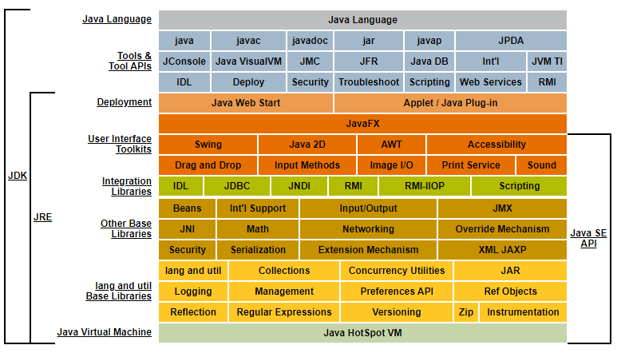

## 1.1 概述（基于 JDK 7）
Java 不仅仅是一门编程语言，还是一个由一系列计算机软件和规范形成的技术体系，这个技术体系提供了完整的用于软件开发和跨平台部署的支持环境。
优点：
- 它摆脱了硬件平台的束缚，实现了“一次编写，到处运行”的理想；
- 它提供了一个相对安全的内存管理和访问机制，避免了绝大部分的内存泄露和指针越界问题；
- 它实现了热点代码检测和运行时编译及优化，这使得 Java 应用能随着运行时间的增加而获得更高的性能；
- 它有一套完善的应用程序接口，还有无数来自商业机构和开源社区的第三方类库来帮助它实现各种各样的功能；
- ......
  
## 1.2 Java 技术体系
从传统意义上看，Sun 官方所定义的 Java 技术体系包括以下组成部分：
- Java 程序设计语言
- 各种硬件平台上的 Java 虚拟机
- Class 文件格式
- Java API 类库
- 来自商业机构和开源社区的第三方 Java 类库

Java 技术体系所包含的内容如图 1-1 所示。  
JDK 7 是 JRE 7 的超集，包含了 JRE 7 的所有内容，以及小程序和应用程序所需的工具，例如编译器和调试器。  
JRE 7 提供了库，Java虚拟机（JVM）和其他组件，以运行用Java编程语言编写的小程序和应用程序。

  
    

 图 1-1 
 
按照技术所服务的领域可划分为：
- Java Card：支持一些 Java 小程序（Applets）运行在小内存设备上的平台。
- Java ME（Micro Edition）：支持 Java 程序运行在移动终端（手机、PDA）上的平台。
- Java SE（Standard Edition）：支持面向桌面级应用（如 Windows 下的应用程序）的 Java 平台。
- Java EE（Enterprise Edition）：支持使用多层架构的企业应用（如 ERP、CRM 应用）的 Java 平台。

## 1.3 Java 发展史
## 1.4 Java 虚拟机发展史
### 1.4.1 Sun Classic/Exact VM
### 1.4.2 Sun HotSpot VM
