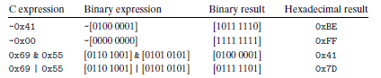

无符号（unsigned）编码基于传统的二进制表示法 
补码（two's-complement）编码是表示有符号整数的最常见的方法（正或负） 
浮点数（floating-point）编码是表示实体的科学计数法的以 2 为基数的版本。 

# 一、信息存储

内存中<strong>最小寻址单位</strong>为 1 个字节（8位），不直接访问内存中的位。 
机器级程序将内存视为一个非常大的字节数组，称为<strong>虚拟内存（virtual memory）</strong>。内存中的每个字节都由一个唯一的数字来标识，称为它的<strong>地址（adress）</strong>。所有可能的地址集合称为<strong>虚拟地址空间（virtual address space）</strong>。

## 1.十六进制表示法
十六进制（hex），使用数字 0-9 和 字符 A-F 来表示 16 个可能的值，在 C 语言中，十六进制的值以 0x 或 0X 开头，字符 A-F 可以是大写，也可以是小写。 

## 2.字数据大小
每台计算机都有一个字长（world size），表明指针数据的标称大小（nominal size）。字长决定了虚拟地址空间的大小，一个字长为  位的机器，虚拟地址范围为 ，虚拟地址空间为  
32 位字长的机器限制虚拟地址空间大小为 4GB（ 字节） 
64 位字长的机器限制虚拟地址空间大小为 16EB （ 字节 1EB = 1024PB 1PB = 1024TB 1TB = 1014GB） 
C 语言在不同机器环境下各种数据类型所占的字节数如图 1 所示，ISO C99 引入了固定的数据类型，如 int32_t 和 int64_t，固定字节数分别为 4 个字节和 8 个字节。 

     

 图 1 
 

## 3.寻址和字节顺序
在几乎所有的机器上，多字节对象都被存储为连续的字节序列，对象的地址为所使用字节中最小的地址。如图 2 所示。 
小端法（little endian）：在内存中按照从最低有效字节到最高有效字节的顺序存储对象。 
大端法（big endian）：在内存中按照从最高有效字节到最低有效字节的顺序存储对象。 

     

 图 2 
 

## 4.表示字符串
C 语言中字符串被编码为一个以 null（值为0）字符结尾的字符数组，每个字符都由某个标准编码表示，最常见的是 ASCII 字符码。

## 5.C 语言中的运算符
### 5.1 位级运算
|、&、、^，如图 3 所示。

     

 图 3 
 

### 5.2 逻辑运算
||、&&、!，如图 4 所示。 

     

 图 4 
 

### 5.3 移位运算
<<、>>（算术右移和逻辑右移，Java 中用 >>> 表示逻辑右移，>> 表示算术右移），如图 5 所示。

     

 图 5 
 

# 二、整数表示

## 1.整型数据类型
C 语言支持的整型数据类型：[signed]char、unsigned char、short、unsigned short、int、unsigned、long、unsigned long、int32_t、uint32_t、int64_t、uint64_t  
C 和 C++ 都支持有符号（默认）和无符号数，Java 只支持有符号数。

## 2.C 语言中有符号数和无符号数
### 2.1 编码表示
无符号数：假设一个整数数据类型为  位，每个介于  之间的数都有一个  位的编码。 
有符号数：采用补码形式来表示（其他方法：反码和原码）
### 2.2 相互转换
C 语言允许在各种不同的数字数据类型之间做强制类型转换：数值可能会变，但是位模式不变。 
有符号数到无符号数的隐式转换会导致错误或漏洞，避免这类错误的一种方法就是禁止使用无符号数。
### 2.3 扩展一个数字的位表示
零扩展（zero extension）：将一个无符号数转换成一个更大的数据类型，在表示的开头添加 0。 
符号扩展（sign extension）：将一个补码数字转换为一个更大的数据类型，在表示中添加最高有效位的值。
