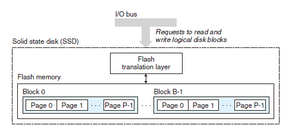
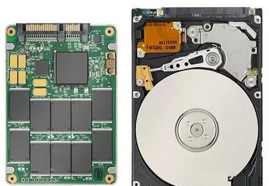

简单的计算机系统模型：CPU 执行指令，而存储器系统为 CPU 存放指令和数据。存储器是一个线性的字节数组，而 CPU 能够在一个常数时间内访问每个存储器的位置。  
存储器系统（memory system）是一个具有不同容量、成本和访问时间的存储设备的层次结构。  
- CPU 寄存器：保存着最常用的数据。
- 高速缓存：靠近 CPU 的小的、快速的<strong>高速缓存存储器（cache memory）</strong>作为一部分存储在相对慢速的主存储器（main memroy）中数据和指令的缓冲区域。
- 主存：主存缓存存储在容量较大的、慢速磁盘上的数据
- 磁盘：常常作为存储在通过网络连接的其他机器的磁盘或磁带上的数据的缓冲区域。

# 一、存储技术
## 1.随机访问存储器
RAM（Random-Access Memory）分为静态 RAM（SRAM）和动态 RAM（DRAM），SRAM 比 DRAM 更快，更贵。SRAM 用来作为高速缓存存储器，可以在 CPU 芯片上，也可以在片下。DRAM 用来作为主存以及图形系统的帧缓冲区。

### 1.1 静态 RAM
SRAM 将每个位存储在一个<strong>双稳态的（bistable）</strong>存储器单元里，如图 1-1 所示，每个单元用一个六晶体管电路来实现。当钟摆倾斜到最左边或最右边时，它是稳定的，在垂直的位置会处于<strong>亚稳态（metastable）</strong>。由于 SRAM 存储器的单元的双稳态特性，即使有干扰来扰乱电压，当干扰消除时，电路就会恢复到稳定值。

<div align = "center">  
    
</div>
<div align = "center"> 图 1-1 </div><br>

### 1.2 动态 RAM
DRAM 将每一个位存储为对一个电容的充电。每个单元由一个电容和一个访问晶体管组成，与 SRAM 不同，DRAM 存储器单元对干扰十分敏感，当电容的电压被扰乱之后，就永远不会恢复了。  
DRAM 和 SRAM 存储器的特性比较如表所示：
| * | 每位晶体管数 | 相对访问时间 | 是否持续 | 是否敏感 | 相对花费 | 应用 |
| -- | -- | -- | -- | -- | -- | -- |
| SRAM | 6 | 1X | 是 | 否 | 1000X | 高速缓存存储器
| DRAM | 1 | 10X | 否 | 是 | 1X | 主存，帧缓冲区

## 2.磁盘存储
磁盘是广为应用的保存大量数据的存储设备，存储磁盘的数量级比基于 RAM 的存储器大的多。不过，从磁盘上读信息的时间为毫秒级，比从 DRAM 读慢了 10 万倍，比从 SRAM 读慢了 100 万倍。

### 2.1 磁盘构造
磁盘由<strong>盘片（platter）</strong>构成。每个盘片有两面或者称为<strong>表面（surface）</strong>，表面覆盖着磁性记录材料。盘片中央有一个可以旋转的<strong>主轴（spindle）</strong>，它使得盘片以固定的<strong>旋转速率（rotational rate）</strong>旋转。一个盘片的视图如图 1-2 所示。每个表面是由一组称为<strong>磁道（track）</strong>的同心圆组成，每个磁道被划分为一个<strong>扇区（selector）</strong>。扇区间由一些<strong>间隙（gap）</strong>分隔开，间隙中不存储数据位，间隙存储用来标识扇区的格式化位。

<div align = "center">  
    
</div>
<div align = "center"> 图 1-2 </div><br>

磁盘是由一个或多个叠放在一起的盘片组成的，如图 1-3 所示，整个装置被称为<strong>磁盘驱动器（disk drive）</strong>，通常称为<strong>磁盘（disk）</strong>，有时，会将磁盘称为<strong>旋转磁盘（rotaing disk）</strong>，使之与基于闪存的<strong>固态硬盘（SSD）</strong>区分开来，SSD 是没有移动部分的。

<div align = "center">  
    
</div>
<div align = "center"> 图 1-3 </div><br>

### 2.2 磁盘容量
一个磁盘上可以记录的最大位数称为它的最大容量，或者简称为容量。由以下技术因素决定：
- 记录密度（recording density）（位/英寸）：磁道一英寸的段中可以放入的位数。
- 磁道密度（track density）（位/英寸）：从盘片中心出发半径上一英寸的段内可以由的磁道数。
- 面密度（areal density）（位/平方英寸）：记录密度与磁道密度的乘积。

磁盘容量 = （字节数/扇区） * （平均扇区数/磁道） * （磁道数/表面） * （表面数/盘片） * （盘片数/磁盘）

### 2.3 磁盘操作
磁盘用<strong>读/写头（read/write head）</strong>来读写存储在磁性表面的位，而读写头连接到<strong>传动臂（actuator arm）</strong>一端，通过沿着半径轴前后移动这个传动臂，驱动器可以将读/写头定位在盘面上的任何磁道上，这个机械运动过程称为<strong>寻道（seek）</strong>，如图 1-4 所示。

<div align = "center">  
    
</div>
<div align = "center"> 图 1-4  </div><br>

### 2.4 逻辑磁盘块
现代磁盘对操作系统隐藏了复杂的构造。磁盘封装中有一个小的硬件/固件设备，称为<strong>磁盘控制器</strong>，维护者逻辑块号和实际（物理）磁盘扇区之间的映射关系。一个逻辑块号可以被翻译为一个（盘面，磁道，扇区）三元组，这个三元组唯一地标识了对应地物理扇区。

### 2.5 连接 I/O 设备
通过 I/O 总线，可以连接到 CPU、主存和 I/O 设备，I/O 总线比系统总线和内存总线慢。如图 1-5 所示，可以连接到 I/O 总线的设备有如下：
- <strong>通用串行总线（Universal Serial Bus，USB）</strong>控制器是一个连接到 USB 总线的设备的中转机构，USB 总线是一个广泛使用的标准，连接各种外围设备，如键盘鼠标等。
- <strong>图形卡（或适配器）</strong>包含硬件和软件逻辑，它们负责代表 CPU 在显示器上画像素。
- <strong>主机总线适配器</strong>将一个或多个磁盘连接到 I/O 总线，两个常用的磁盘接口是 SCSI 和 SATA。

<div align = "center">  
    
</div>
<div align = "center"> 图 1-5  </div><br>

## 3.固态硬盘
固态硬盘（Solid State Disk，SSD）是一种基于闪存（flash memory）的存储技术，SSD 封装插到 I/O 总线上标准硬盘插槽（通常是 USB 或 SATA）中，一个 SSD 封装由一个或多个闪存芯片和闪存翻译层（flash translation layer）组成。闪存芯片替代传统旋转磁盘中的机械驱动器，而闪存翻译层是一个硬件/固件设备，扮演与磁盘控制器相同的角色，将对逻辑块的请求翻译成对底层物理设备的访问，如图 1-6 所示。

<div align = "center">  
    
</div>
<div align = "center"> 图 1-6  </div><br>

读 SSD 的速度快于写，随机读和写的性能差别由底层闪存基本属性决定的。数据是以页的单位读写的，只有在一页所属的块整个被擦除后，才能写这一页（通常是该块中的所有位都被设置为1）。  
随机写慢的两个原因：
- 擦除块需要相对较长的时间，1ms 级的，比访问页所需时间要高一个数量级。
- 如果写操作试图修改一个包含已经有数据（也就是不是全为 1）的页 p，那么这个块中所有带有用数据的页都被必须复制到一个新（擦除过的）块，然后才能进行对页 p 的写。

SSD 比起旋转磁盘，如图 1-7 所示。
- 优点：没有移动的部件，因而随机访问时间比旋转磁盘更快，能耗更低，同时也更结实。
- 缺点：因为反复写之后，闪存块会磨损，所以 SSD 也容易磨损。

<div align = "center">  
    
</div>
<div align = "center"> 图 1-7  </div><br>

# 二、局部性
一个编写良好的计算机程序常常具有良好的局部性（locality）。也就是，它们倾向于引用邻近于其他最近引用过的数据项的数据项，或者最近引用过的数据项本身，这种倾向性，被称为<strong>局部性原理（principle of locality）</strong>。有良好局部性的程序比局部性差的程序运行得更快。
- 时间局部性（temporal locality）：在一个具有良好时间局部性的程序中，被引用过一次的内存位置很可能在不远的将来被多次引用。
- 空间局部性（spatial locality）：在一个具有良好空间局部性的程序中共，如果一个内存的位置被引用了一次，那么程序很可能在不远的将来引用附近的一个内存位置。

## 1.对程序数据引用的局部性
一个具有良好局部性的程序如下所示：
- 变量 sum 在每次循环迭代中被引用一次，因此，对于 sum 来说，具有良好的时间局部性。另一方面，因为 sum 是标量，对于 sum 来说，没有空间局部性。
- 因为数组在内存中的存储是连续的，数组 v 在程序中被顺序读取，因此，对于数组 v，函数具有良好的空间局部性，但是时间局部性很差，因为每个数组元素只被访问一次。

像 sumVector 函数这样顺序访问数组中的每一个元素，具有<strong>步长为 1 的引用模式（stride-1 reference pattern）</strong>。有时称步长为 1 的引用模式为<strong>顺序引用模式</strong>。一个连续向量中，每隔 k 个元素进行访问，就称为<strong>步长为 k 的引用模式</strong>。一般而言，随着步长的增加，空间局部性下降。
```
private int sumVector(int[] v) {
    int sum = 0;
    for (int i = 0; i < v.length; i++) {
        sum += v[i];
    }
    return sum;
}
```

## 2.取指令的局部性
因为程序指令是存放在内存中的，CPU 必须取出（读出）这些指令。上一段代码中 for 循环体里的指令是按照连续的内存顺序执行的，而且循环体会被执行多次，因此具有良好的时间局部性和空间局部性。

## 3.局部性小结
- 重复引用相同变量的程序有良好的时间局部性。
- 对于具有步长为 k 的引用模式的程序，步长越小，空间局部性越好。具有步长为 1 的应用模式的程序有良好的空间局部性。在内存中以大步长跳来跳去的程序空间局部性会很差。
- 对于取指令来说，循环有好的时间和空间局部性。循环体越小，循环迭代次数越多，局部性越好。

# 三、存储器层次结构
- 存储技术：不同存储技术的访问时间差异很大。速度较快的技术每字节的成本要比速度较慢的技术高，而且容量较小。CPU 和主存之间的速度差距在增大。
- 计算机软件：一个编写良好的程序倾向于展示出良好的局部性。
一个典型的存储器层次结构如图 3-1 所示。

<div align = "center">  
    
</div>
<div align = "center"> 图 3-1  </div><br>

## 1.存储器层次结构中的缓存
 存储器层次结构的中心思想是，对于每个 k，位于 k 层的更快更小的存储设备作为位于 k+1 层的更大更慢的存储设备的缓存。第 k+1 层的存储器被划分称连续的数据对象<strong>组块（chunk）</strong>，称为<strong>块（block）</strong>。第 k 层的缓存包含第 k+1 层块的一个子集的副本。如图 3-2 所示。数据总是以块大小为<strong>传送单元（transfer unit）</strong>在第 k 层和第 k+1 层之间来回复制的。

 <div align = "center">  
    
</div>
<div align = "center"> 图 3-2  </div><br>

### 1.1 缓存命中
当程序需要第 k+1 层的某个数据对象 d 时，首先在当前存储的第 k 层的一个块中查找 d。如果 d 刚好缓存在第 k 层，那就是<strong>缓存命中（cache hit）</strong>。从第 k 层直接读取 d，比从第 k+1 层读取 d 更快。

### 1.2 缓存不命中
如果在第 k 层没有缓存数据对象 d，则为<strong>缓存不命中（cache miss）</strong>。第 k 层的缓存会从第 k+1 层缓存中取出包含 d 的那一块，如果第 k 层的缓存满了，可能就会覆盖已有的块。  
覆盖一个已有块的过程称为<strong>替换（replacing）</strong>或<strong>驱逐（evicting）</strong>这个块。被驱逐的这个块有时也称为<strong>牺牲块（victim block）</strong>。决定替换哪个块是由缓存的<strong>替换策略（replacement policy）</strong>决定的。

### 1.3 缓存不命中的种类
- 一个空的缓存有时被称为<strong>冷缓存（cold cache）</strong>，此类不命中称为<strong>强制不命中（compulsory miss）</strong>或<strong>冷不命中（cold miss）</strong>。  
只要发生了不命中，第 k 层缓存就必须执行某个<strong>放置策略（placement policy）</strong>，确定把它从第 k+1 层中取出的块放到哪里。
- 如图 3-2 所示，我们可以确定 k+1 层的块 i 必须防止在第 k 层的块（i mod 4）中。这种限制性的放置策略会引起<strong>冲突不命中（conflict miss）</strong>。例如：如果程序请求块 0，然后块 8 ，然后块 0，然后块 8，依次类推，在第 k 层的缓存中，对两个块的每次引用都不会命中。
- 一个嵌套的循环可能会反复地访问同一个数组地元素，这个块的集合称为这个阶段的<strong>工作集（working set）</strong>。当工作集的大小超过缓存的大小时，缓存会经历<strong>容量不命中（capacity miss）</strong>。

## 2.存储器层次结构概念小结
- 利用时间局部性：由于时间局部性，同一数据对象可能会被多次使用。一旦一个数据对象在第一次不命中时被复制到缓存中，我们就会期望后面对该目标有一系列的访问命中。因为缓存比低一层的存储设备更快，对后面的命中服务会比最开始的不命中快很多。
- 利用空间局部性：块通常包含有多个数据对象。由于空间局部性，我们会期望后面对该块中其他对象的访问能够补偿不命中后复制该块的花费。